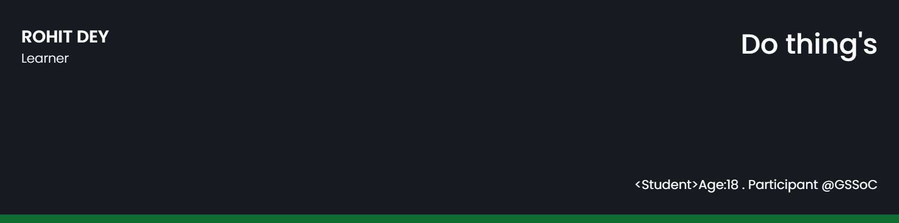

# Myself-Rohit-Dey <!---->

  

<!-- links to your social media accounts -->

<h2> 𝐇𝐞𝐥𝐥𝐨 𝐭𝐡𝐞𝐫𝐞, 𝐟𝐞𝐥𝐥𝐨𝐰 <𝚌𝚘𝚍𝚎𝚛𝚜/>! </h2>

<h3> I am Rohit Dey. I am pursuing my B.Tech in MCKV Institute of Engineering, Howrah, West Bengal. I love to explore and learn about new things.</h3>

## 🧔 About Me

- 💻 Currently Working on learning Full Stack technologies and building my carrer

- 🔭 Worked on [Neo Algo](https://github.com/TesseractCoding/NeoAlgo) & [Master PyAlgo](https://github.com/Developer-Student-Clubs-VSSUT-Burla/Master-PyAlgo) under GSSoC'21
<!--[CSS art gallary](https://github.com/salil-naik/css-art-gallary)-->

- 🌱 I’m currently learning **DSA & Web Technologies**

- 👯 I’m looking to collaborate on Open Source Projects

- 😄 Pronouns: He/His

- ⚡ Fun fact: Success Behind Failure

## 📚 My Skills
 

 
 
 
  
  
 
 

<!--

-->

## 🏆Github Profile stats

  
  

<!--

-->

  

  
 
 

<!-- -->

<h2 align="center">Visitor's Count </h2>

## ✍ My Work
<!--

-->
Here are some of my projects on Github that I am proud of:

## 🤝 Connect 

<!--

## 🤝 Connect
 &nbsp;&nbsp;&nbsp;
 &nbsp;&nbsp;&nbsp;
 &nbsp;&nbsp;&nbsp;

 &nbsp;&nbsp;&nbsp;
 &nbsp;&nbsp;&nbsp;
 &nbsp;&nbsp;&nbsp;
-->

